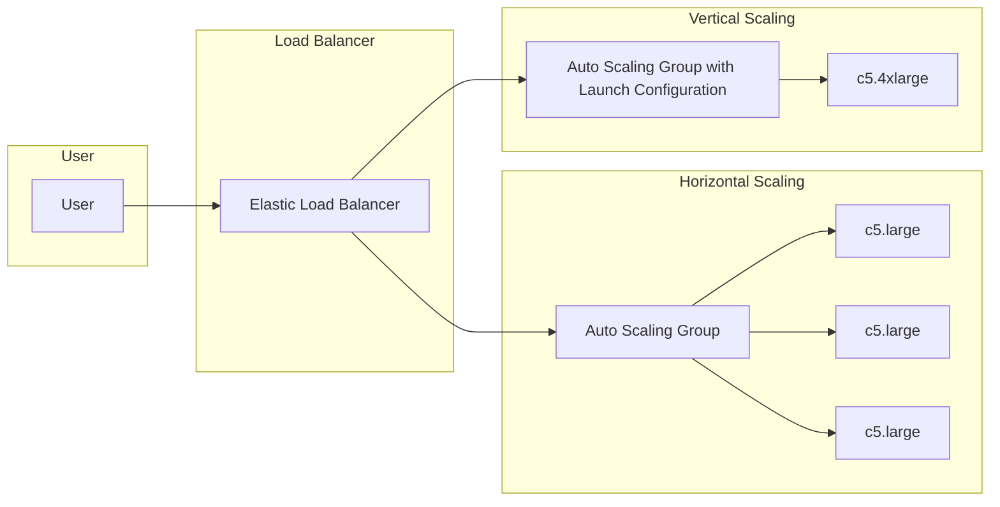

# EC2 Auto Scaling

#20230316

## References: 

- [OpenAI](http://chat.openai.com)
- [Amazon](https://aws.amazon.com/getting-started/)

---

- AWS Auto Scaling is a service that allows you to automatically scale your
  Amazon Elastic Compute Cloud (Amazon EC2) instances up or down based on
  demand. Auto Scaling helps ensure that you have the correct number of
  instances to handle the load of your applications. It can also help reduce
  costs by automatically scaling down your instances when demand decreases.

- There are two types of scaling: `horizontal` scaling and `vertical` scaling.

- Horizontal scaling involves adding or removing EC2 instances to increase or
  decrease capacity. This type of scaling is ideal for applications that can
  run on multiple servers, such as web applications.

- Vertical scaling involves increasing or decreasing the capacity of individual
  EC2 instances by changing their instance types. This type of scaling is ideal
  for applications that require more CPU, memory, or I/O resources.

- In this example, we have a user accessing the application through an Elastic
  Load Balancer (ELB), which distributes traffic across an Auto Scaling Group
  (ASG) containing three EC2 instances of type c5.large. The ASG is set up to
  horizontally scale based on the demand, adding or removing EC2 instances as
  needed.

- However, if there's a sudden surge in traffic, horizontal scaling might not
  be enough to handle the load. In this case, we can use vertical scaling to
  add more resources to each EC2 instance. To do this, we create a new launch
  configuration with a larger instance type, in this case c5.4xlarge, and
  associate it with a new Auto Scaling Group (ASGLC). The ELB is then
  configured to distribute traffic across both ASGs.

- This way, as the demand for resources increases, both horizontal and vertical
  scaling mechanisms are used to ensure the application can handle the load.

