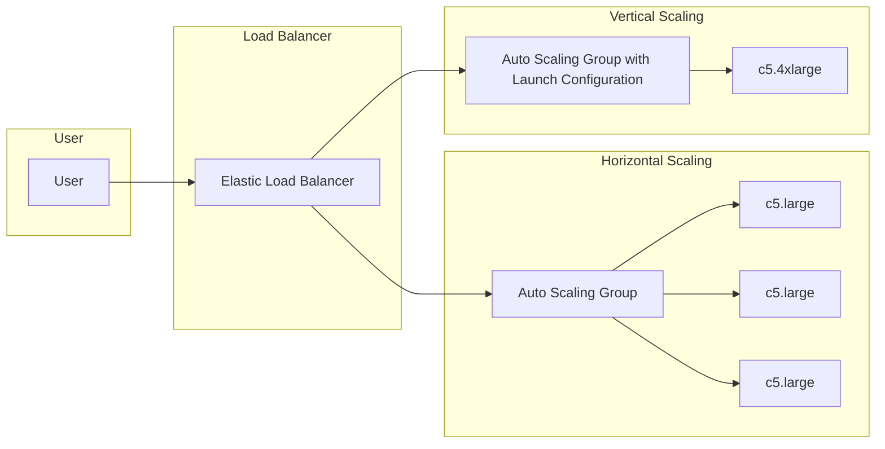

# EC2 Auto Scaling

#20230316

## References: 

- [OpenAI](http://chat.openai.com)
- [Amazon](https://aws.amazon.com/getting-started/)

---

## Introduction

AWS Auto Scaling is a service that allows you to automatically scale your
Amazon Elastic Compute Cloud (Amazon EC2) instances up or down based on demand.
Auto Scaling helps ensure that you have the correct number of instances to
handle the load of your applications. It can also help reduce costs by
automatically scaling down your instances when demand decreases.

There are two types of scaling: `horizontal` scaling and `vertical` scaling.

- Horizontal scaling involves adding or removing EC2 instances to increase or
  decrease capacity. This type of scaling is ideal for applications that can
  run on multiple servers, such as web applications.

- Vertical scaling involves increasing or decreasing the capacity of individual
  EC2 instances by changing their instance types. This type of scaling is ideal
  for applications that require more CPU, memory, or I/O resources.

- In this example, we have a user accessing the application through an Elastic
  Load Balancer (ELB), which distributes traffic across an Auto Scaling Group
  (ASG) containing three EC2 instances of type c5.large. The ASG is set up to
  horizontally scale based on the demand, adding or removing EC2 instances as
  needed.

- However, if there's a sudden surge in traffic, horizontal scaling might not
  be enough to handle the load. In this case, we can use vertical scaling to
  add more resources to each EC2 instance. To do this, we create a new launch
  configuration with a larger instance type, in this case c5.4xlarge, and
  associate it with a new Auto Scaling Group (ASGLC). The ELB is then
  configured to distribute traffic across both ASGs.

- This way, as the demand for resources increases, both horizontal and vertical
  scaling mechanisms are used to ensure the application can handle the load.

---

## Step 1: Launch an EC2 instance

The first step in setting up auto scaling is to launch an EC2 instance. This
will serve as the base instance for your auto scaling group.

To launch an EC2 instance, follow these steps:

1. Log in to your AWS account and navigate to the EC2 dashboard.
2. Click on `Launch Instance` to start the launch wizard.
3. Choose the AMI (Amazon Machine Image) you want to use for your instance.
3. Select the instance type that you want to use.
4. Configure your instance by selecting your desired network settings, storage options, and security settings.
5. Review your settings and launch your instance.

## Step 2: Create an Auto Scaling Group

Now that you have launched your EC2 instance, the next step is to create an
Auto Scaling Group. This will allow AWS to automatically add or remove
instances based on demand.

To create an Auto Scaling Group, follow these steps:

1. Navigate to the EC2 dashboard and select `Auto Scaling Groups` from the sidebar.
2. Click on `Create Auto Scaling Group` to start the wizard.
3. Choose your launch template or launch configuration that you want to use for your instances.
4. Configure your Auto Scaling Group by specifying your desired capacity, scaling policies, and other settings.
5. Review your settings and create your Auto Scaling Group.

## Step 3: Configure Auto Scaling Policies

Now that you have created your Auto Scaling Group, the next step is to
configure your scaling policies. These policies will dictate when AWS should
add or remove instances from your group.

To configure your Auto Scaling Policies, follow these steps:

1. Navigate to the EC2 dashboard and select `Auto Scaling Groups` from the sidebar.
2. Select your Auto Scaling Group from the list.
3. Click on the `Policies` tab.
4. Click on `Create Policy` to start the wizard.
5. Choose your scaling metric (CPU utilization, network in/out, etc.) and set your desired thresholds.
6. Configure your scaling actions by specifying the number of instances to add or remove.
7. Review your settings and create your scaling policy.

## Step 4: Test Your Auto Scaling Group

Now that you have created your Auto Scaling Group and configured your scaling
policies, the final step is to test your group to ensure that it is working as
expected.

To test your Auto Scaling Group, follow these steps:

1. Navigate to the EC2 dashboard and select `Auto Scaling Groups` from the sidebar.
2. Select your Auto Scaling Group from the list.
3. Click on the `Instances` tab to view the instances in your group.
4. Manually adjust your instance's workload to trigger the scaling policies.
5. Monitor your Auto Scaling Group to ensure that new instances are being added or removed as expected.

